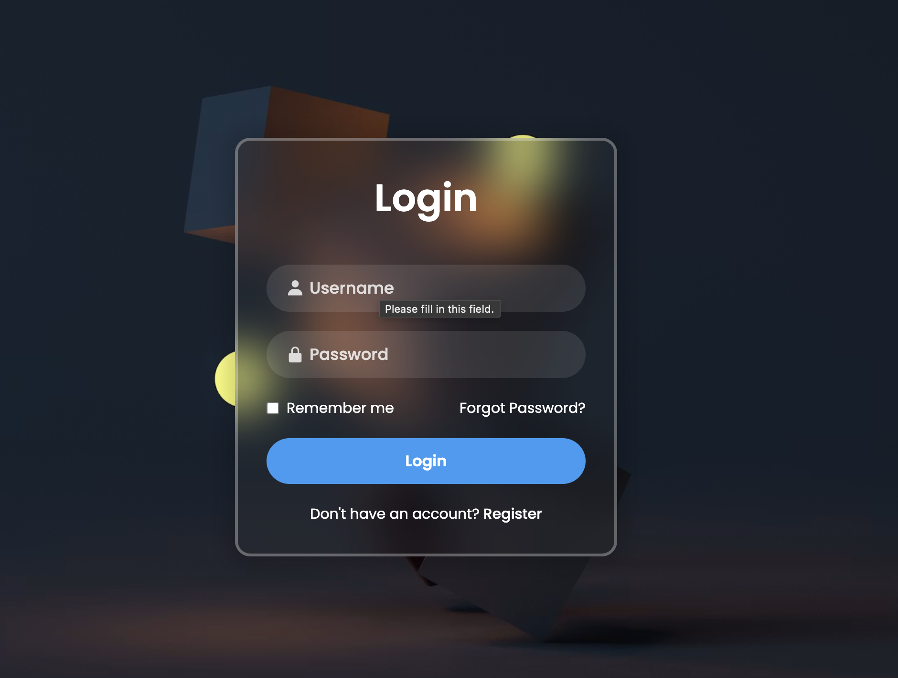

# 🔐 Glassmorphism Login Form

A modern and responsive **Glassmorphism Login Form** built using **HTML5** and **CSS3**. This project features a beautiful blurred glass effect, a full-screen background image, smooth hover effects, and a clean user interface.

---

## 📸 Preview




---

## ✨ Features

- 🎨 Modern Glassmorphism UI
- 📱 Responsive Design
- 🔒 Password Input Field
- 👤 User & Lock Icons (Boxicons)
- 🌄 Full-screen Background Image
- 💎 Blur Effect using `backdrop-filter`
- 🖱️ Smooth Button Hover Effects
- 📝 Remember Me Checkbox
- 🔗 Forgot Password & Register Links

---

## 🛠️ Technologies Used

- HTML5
- CSS3
- Google Fonts (Poppins)
- Boxicons

---


## 🚀 Getting Started

### Clone the repository

```bash
git clone https://github.com/Rajksri02/Login-Form.git
```

### Open the project

Simply open the `index.html` file in your browser.

---

## 📷 Screenshot


---


## 👨‍💻 Author

** Raj Kumar Keshari **

⭐ If you like this project, don't forget to star the repository!
